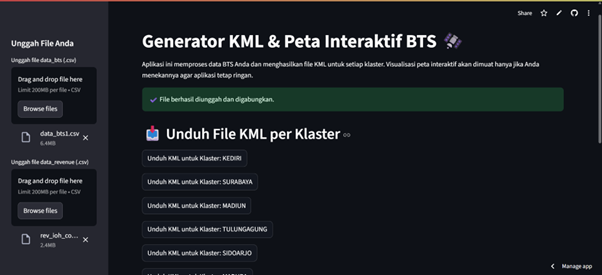
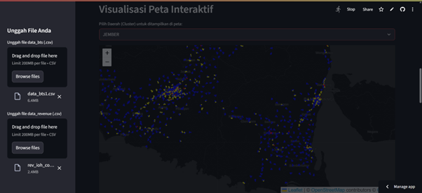

# Generator KML & Peta Interaktif BTS

Aplikasi untuk memproses data BTS dan revenue, lalu mengubahnya menjadi file KML dan visualisasi peta interaktif.

---

## ✨ Fitur Utama

- **Proses Data Otomatis**: **Unggah** file `.csv` (data BTS & data revenue) untuk digabungkan dan diproses secara otomatis.
- **Generator KML**: **Hasilkan** file `.kml` yang dikelompokkan per klaster (wilayah) dan siap diunduh untuk digunakan di Google Earth.
- **Peta Interaktif**: **Visualisasikan** sebaran lokasi BTS di peta, lengkap dengan filter untuk menampilkan data berdasarkan klaster.

---

## 📸 Tangkapan Layar

**Halaman Unggah & Unduh KML**

**Visualisasi Peta Interaktif**

---

## 🚀 Cara Penggunaan

1.  **Unggah** kedua file `.csv` (`data_bts` dan `data_revenue`) pada kolom yang tersedia.
2.  Tunggu notifikasi sukses, lalu **unduh** file KML yang Anda butuhkan.
3.  Untuk visualisasi, **pilih klaster** dari menu dropdown untuk menampilkannya di peta.
